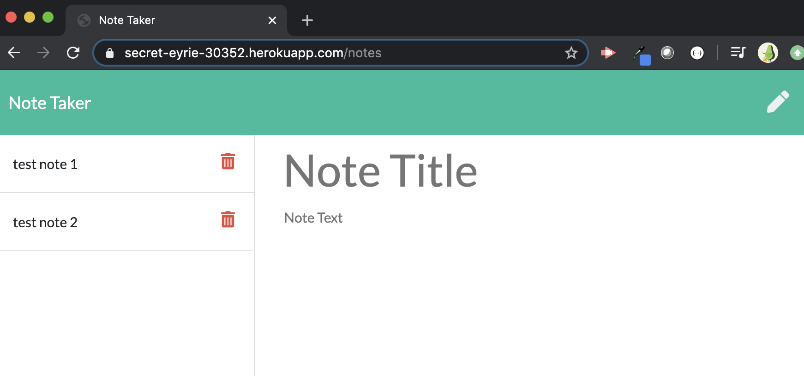

## Name and live url
Stephanie Kuo Week10 - Note Taker
https://sfds1.github.io/hw10notetaker


## Description
This is an application that can be used to write, save, and delete notes. 

## What does the app do?
This application will use an express backend and save and retrieve note data from a JSON file.


## How does it work?
The application  will be invoked with the following command:

```sh
nodemon server.js
```

## Technologies
Node, HTML, CSS, Javascript

## Languages, frameworks, various tools
This application uses Node packages Express, FS, PATH and MySQL.

## Challenges
Knowing to put the wildcard (*) route at the end of all the routes otherwise none of the routes would work.

## Your experience building this app


## What was difficult


## What did you learn
Heroku is pretty cool.
For me: Look in Week 11, 04-Supplemental for instructions on how to set up Heroku url

## How did you go about solving a problem


## Screenshot


## Live app, not code



